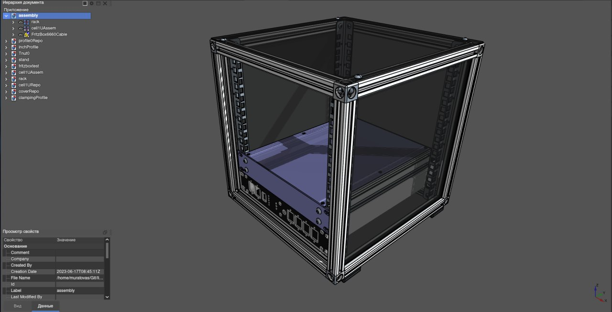

# case

In this repository you will find a parameterized 10" rack model. The project was developed in FreeCAD. Can be used to generate a rack with any geometric characteristics.

## Standard Rack options
19”(48.26cm) Rack
600/800/900mm

https://grabcad.com/library/19inch-cabinet-1

https://grabcad.com/library/schroff-19-3u-case

https://grabcad.com/library/wooden-server-rack-600x950x42he-update-1

https://grabcad.com/library/mobile-ups-rack-1

https://grabcad.com/library/cool-look-19-inches-case-with-raspberry-pi-and-e2000-1

9.5”(24.13cm) Half-Rack
100/200/280/300x210x44mm

http://www.allmetalparts.co.uk/54-5-inch-half-rack-system

https://grabcad.com/library/10zoll_usv_apc_be850g2-gr-1

https://gie-tec.de/wp-content/uploads/2017/03/db_133050.pdf

5.25”(133.35mm) Rack
170x146x42mm

https://www.aliexpress.com/item/32383530551.html

3.5"(88.9mm) Rack
147x101.6x26mm

https://www.aliexpress.com/item/1005005398767540.html

https://www.aliexpress.com/item/1005004762858389.html

## Typical profile options
### Square
(!)https://www.rsi-llc.ru/catalog/68/521/

(A)https://xn--80aaxidg9j.xn--p1ai/catalog/20_ya_seriya_bp/alyuminievyy_konstruktsionnyy_profil_20x20_bez_pokrytiya/

### Rectangular
(!)https://www.rsi-llc.ru/catalog/68/522/

### Clamping profile
(!)https://www.rsi-llc.ru/catalog/86/243/

(!)https://www.rsi-llc.ru/catalog/127/1147/

(!)https://www.rsi-llc.ru/catalog/76/1257/ 

(!)https://www.rsi-llc.ru/catalog/86/1331/

(-)https://www.rsi-llc.ru/catalog/82/278/

(-)https://www.rsi-llc.ru/catalog/73/362/

### Other
(-)https://www.vseinstrumenti.ru/product/komplekt-vertikalnyh-yunitovyh-napravlyayuschih-tsmo-2-sht-dlya-shkafov-vysotoj-6u-shrn-vn-6-1553303/

## Credit
https://grabcad.com/library/10zoll_usv_apc_be850g2-gr-1

https://grabcad.com/library/10zoll_fritzbox6660_cable-1

https://grabcad.com/library/10zoll_itx-server-1